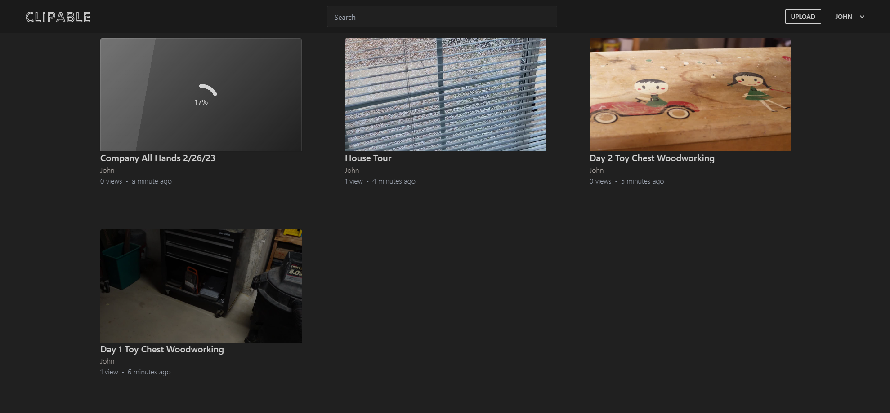

 

    

 

<h3 align="center">Simple video hosting. &nbsp; For everyone.</h3>

 

    
    &nbsp;
    
    &nbsp;
    
    &nbsp;
	
    &nbsp;
    

 

<h2>&nbsp;&nbsp;What is Clipable?</h2>

Clipable is a self-hosted video sharing platform that provides an easy and efficient way for individuals and organizations to host, share, and manage their video content. Inspired by popular platforms like Streamable and YouTube, Clipable offers a simple and intuitive user interface that makes it easy for anyone to upload, share, and watch videos with ease. With a focus on privacy and security, Clipable provides an alternative for those looking for a more controlled and self-reliant video hosting solution. Whether you're a content creator, a business owner, or just someone looking to share videos with friends and family, Clipable provides all the features you need to manage your video content with confidence.

### Live, view-only demo [here](https://clipable.net/).  

View the [features](https://github.com/clipable/clipable/blob/master/README.md#features), the latest [releases](https://github.com/clipable/clipable/releases), the product [roadmap](https://github.com/clipable/clipable/milestones), and [documentation](https://github.com/clipable/clipable/wiki).

<h2>&nbsp;&nbsp;Contents</h2>

- [Features](#features)
- [Documentation](https://github.com/clipable/clipable/wiki)
- [Run using Docker](#run-using-docker)
- [Contributing](#contributing)

<h2>&nbsp;&nbsp;Features</h2>

- [x] Responsive, In-Browser upload
- [x] Configurable video quality profiles
- [x] S3 compatible video storage
- [x] User accounts
- [x] Fuzzy video searching
- [x] Intuitive and simple user interface
- [x] Well-documented and accessible REST API
- [x] FFmpeg based encoding accepts all well known video formats
- [x] Simple docker based deployment

<h2>&nbsp;&nbsp;Run using Docker</h2>  

Getting started is easy with Docker!  
 You can start by copying our [docker-compose.yml](https://github.com/clipable/clipable/blob/master/docker-compose.yml) and simply run `docker compose up -d`. The site will then be accessible at http://localhost/. If you plan on accessing it from a seperate URL, it's important to set the `COOKIE_DOMAIN` to that domain. You can view documentation about all of our environment variables [here.](https://github.com/clipable/clipable/wiki/Environment-Variables)
<h2>&nbsp;&nbsp;Contributing</h2>
 TODO

<h2>&nbsp;&nbsp;License</h2>  

Clipable is licensed under the [BSL 1.1 license](https://github.com/clipable/clipable/blob/master/LICENSE), converting to the open-source GNU General Public License v2.0 or later after 4 years. If you'd like to learn more, you can do so [here](https://mariadb.com/bsl-faq-adopting/).
